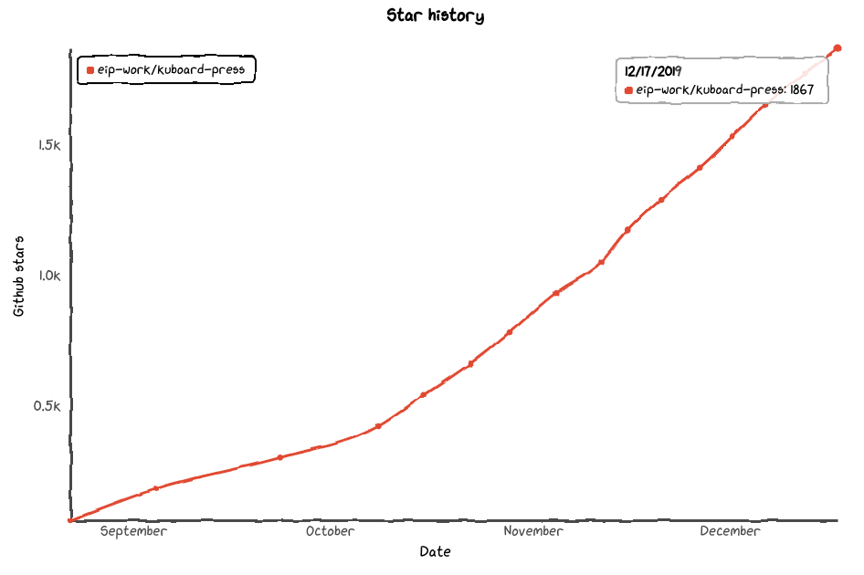
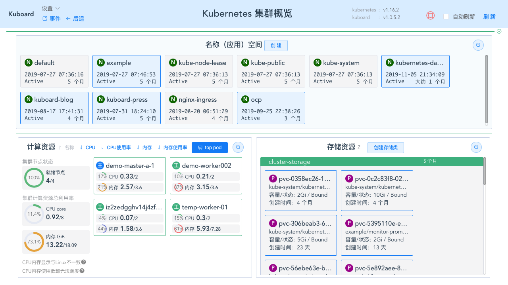
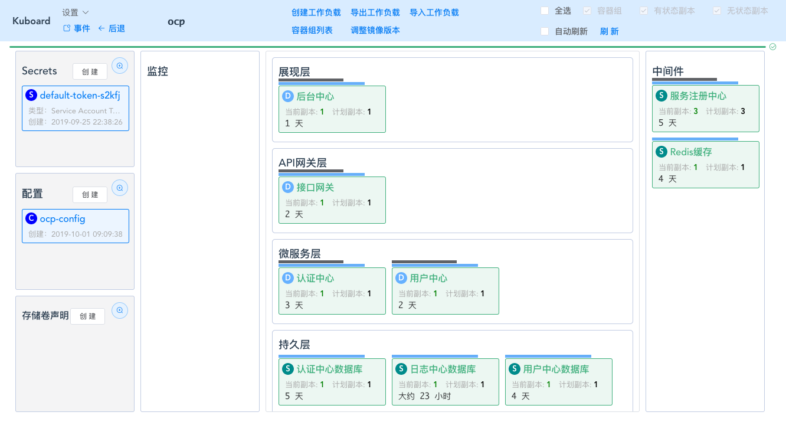
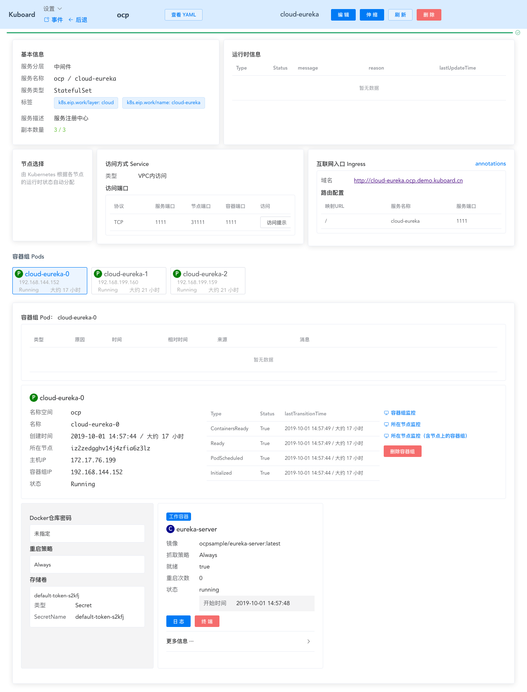

# Kuboard介绍

<AdSenseTitle/>

Kubernetes 容器编排已越来越被大家关注，然而学习 Kubernetes 的门槛却依然很高，主要体现在这几个方面：

* 集群的安装复杂

* Kubernetes相较于容器，引入了许多新的概念

* 需要手工编写 YAML 文件

* 没有好的参考案例可以遵循


今天给大家介绍的这款工具 Kuboard，是一款免费的 Kubernetes 图形化管理工具，Kuboard 力图帮助用户快速在 Kubernetes 上落地微服务。为了达到此目标，Kuboard 提供了针对上述问题的解决办法：

* Kuboard 提供 Kubernetes 免费安装文档、免费在线答疑，每天约有 200 位网友参照 Kuboard 提供的文档进行 K8S 集群安装。
* Kuboard 提供 Kubernetes 免费中文教程、用户无需付费购买视频教程或参加线下培训班，就可参照 Kuboard 提供的免费教程完成 K8S 的学习，更有 QQ 社群可以和网友互相讨论，共同进步。
* Kuboard 是 Kubernetes 的一款图形化管理工具，使用 Kuboard，用户无需编写 YAML 文件，就可以完成应用程序的部署和管理。
* Kuboard 提供 Spring Cloud 等微服务参考架构在 K8S 上的详细部署文档和步骤，是 Spring Cloud 用户将自己的应用迁移到 K8S 部署环境的非常好的参考资料。


Kuboard 地址：[https://kuboard.cn](https://kuboard.cn/)

Kuboard 在 github 已获得 1867 star，获得了许多用户的喜爱。




## 安装Kuboard

如果您已经有了 Kubernetes 集群，只需要一行命令即可安装 Kuboard：

``` sh
kubectl apply -f https://kuboard.cn/install-script/kuboard.yaml
```

然后访问您集群中任意节点的 32567 端口（http://any-of-your-node-ip:32567），即可打开 Kuboard 界面。


## 使用Kuboard

Kuboard 通过三层界面来管理 Kubernetes 以及部署在其上的微服务应用，使得一个非常复杂的系统变得易于理解：

1. 集群概览层

   Kuboard 中查看集群概览的界面如下图所示，下层由 Kubernetes 的计算资源和存储资源组成，上层则是应用的名称空间。

   

2. 名称空间层

   进入 Kuboard 名称空间界面后，可以看到该名称空间下部署的所有应用、配置信息、存储卷声明，以及在名称空间内可执行的操作，例如创建工作负载、导出工作负载、导入工作负载、容器组列表、调整镜像版本等。

   这里比较特殊的一点是，Kuboard 以分层的方式展现微服务架构的经典分层，包括展现层、API网关层、微服务层、持久层、中间件层和监控层。

   

3. 工作负载层

   从名称空间点击某一个应用模块后，可进入到工作负载的详情页。在这里可以看到控制器（Deployment、StatefulSet、DaemonSet等）的详细信息，也可以看到其管理的 Pod 的详情、监控、Pod 的日志、Pod的命令行控制台等。

   在 Kuboard 工作负载编辑器里，可以通过图形界面完成应用的部署和管理、伸缩、卸载等操作，而无需编写复杂的 yaml 文件。

   


## Kubernetes免费教程

### **Kubernetes 体验**

* 安装 Kubernetes 单Master节点（30分钟，初学者也许需要更多）

* 安装微服务管理界面（5分钟）

* 创建 busybox（10分钟）

* 导入 example 微服务应用（15分钟）

### **Kubernetes 入门**

* 0. 学习Kubernetes基础知识 (10分钟)

* 1. 部署一个应用程序 (5分钟)

* 2. 查看 Pods / Nodes (10分钟)

* 3. 公布应用程序 (10分钟)

* 4. 伸缩应用程序 (10分钟)

* 5. 执行滚动更新 (10分钟)

* 6. 复习Kubernetes核心概念 (10分钟)

### **Kubernetes 进阶**

* 使用私有 registry 中的 docker 镜像

* 工作负载
  * 容器组 - 概述
  * 容器组 - 生命周期
  * 容器组 - 初始化容器
  * 控制器 - 概述
  * 控制器 - Deployment
  * 控制器 - StatefulSet
  * 控制器 - DaemonSet
  * 控制器 - Job
  * 控制器 - CronJob

* 服务发现、负载均衡、网络
  * Service 概述
  * Service 详细描述
  * Service/Pod 的 DNS
  * Service 连接应用程序
  * Ingress 通过互联网访问您的应用
  * 如何选择网络插件

* 存储
  * 数据卷 Volume
  * 存储卷 PV 和存储卷声明 PVC
  * 存储类 StorageClass
  * 自建 NFS 服务

* 配置
  * 使用 ConfigMap 配置您的应用程序
  * 管理容器的计算资源
  * 将容器调度到指定的节点
  * 污点和容忍 taints and toleration
  * Secrets

### **Kubernetes 高级**

* 问题诊断
  - [诊断应用程序](https://kuboard.cn/learning/k8s-advanced/ts/application.html)
  - [诊断集群问题](https://kuboard.cn/learning/k8s-advanced/ts/cluster.html)
  - [Deployment故障排除图解](https://kuboard.cn/learning/k8s-advanced/ts/deployment.html)
* 日志
  - [日志](https://kuboard.cn/learning/k8s-advanced/logs/)
* 调度
  - [调度](https://kuboard.cn/learning/k8s-advanced/schedule/)
  - [调度调优](https://kuboard.cn/learning/k8s-advanced/schedule/tuning.html)
  - [调度框架](https://kuboard.cn/learning/k8s-advanced/schedule/framework.html)
* 策略
  - [Limit Range](https://kuboard.cn/learning/k8s-advanced/policy/lr.html)
  - [Resource Quota](https://kuboard.cn/learning/k8s-advanced/policy/rq.html)
* 安全
  - [RBAC 授权接口](https://kuboard.cn/learning/k8s-advanced/sec/rbac/api.html)
  - [RBAC Example](https://kuboard.cn/learning/k8s-advanced/sec/rbac/example.html)
* 监控
* 联邦

## Spring Cloud在Kubernetes上的部署实战

在 Kubernetes 上部署 Spring Cloud 微服务

* 准备
  * 准备OCP的构建环境和部署环境
  * 构建docker镜像并推送到仓库

* 部署
  * 部署顺序
  * 在K8S上部署eureka-server
  * 在K8S上部署mysql
  * 在K8S上部署redis
  * 在K8S上部署auth-server
  * 在K8S上部署user-center
  * 在K8S上部署api-gateway
  * 在K8S上部署back-center
  * 重新审视配置信息

* 多环境
  * 导出部署配置
  * 导入部署配置
