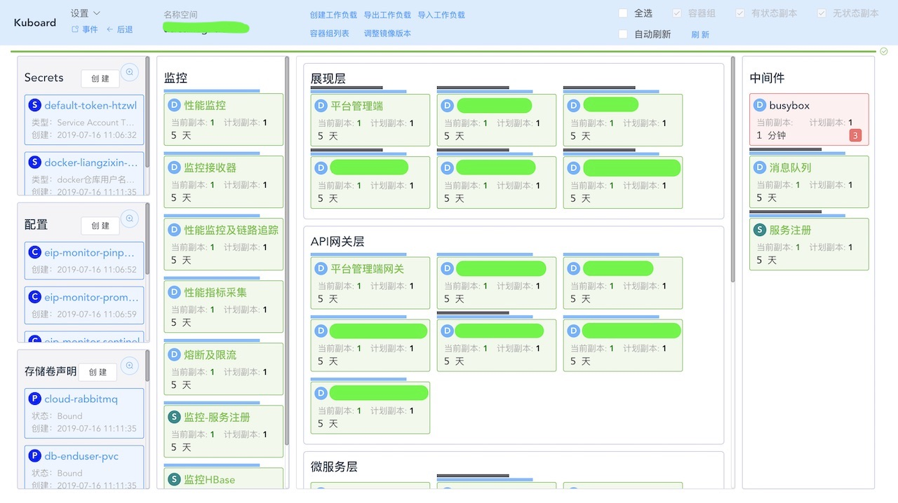

# 为什么选择Kuboard

<AdSenseTitle/>

Kubernetes 已然是当下容器编排领域事实上的标准，各大云服务商都急于推出 Kubernetes 服务，互联网公司也纷纷跟进，将自己的应用容器化，并使用 Kubernetes 编排。

在 Kubernetes 图形化工具方面，我们已经获得了极大的可选择空间：

* 各云服务商自己推出的 Kubernetes 服务所搭载的管理控制台，例如 阿里云的 Kubernetes 服务，青云推出的 KubeSphere，其他云服务商的 CaaS 类服务
* Kubernetes 官方的图形管理界面 Kubernetes Dashboard
* 面向企业私有化部署的 Rancher

什么场景下更适合选择 Kuboard 呢？

## Kubernetes 入门学习者

​	Kuboard类似于 Kubernetes Dashboard，是一款轻量级产品，按照 Kuboard 的文档，您可以很快地搭建一套学习 Kubernetes 用的集群环境，您也可以在自己已经有的集群上轻易地完成 Kuboard 的安装。

​	对于 K8S 入门学习者来说，看了那么多 Kubernetes 文章，了解了许多的跟 apiserver、etcd、pod、container、service、ingress、storage class等各种概念，都不如比不上自己动手搭一套 K8S 环境，并在其上部署一套微服务应用的效果好。Kuboard 完全采用场景化的设计，操作过程更适合人们的思考方式。例如，集群概览的展示方式、名称空间的展示方式。

### 集群概览

在 Kuboard 中，集群概览的展现形式如下：

​	计算资源、存储资源并列在集群概览的下层，上层则是运行于计算资源与存储资源上的名称空间（应用）。

### 名称空间

在 Kuboard 中，名称空间的展示形式如下：

​	以微服务参考分层架构的形式，将所有的微服务分为如下几层：

* 展现层
  * 终端用户访问的 Web 应用
* API网关层
  * Spring Cloud Gateway / Zuul /Kong 等接口网关
* 微服务层
  * Spring Boot 微服务，或 PHP / Python 实现的微服务
* 持久层
  * MySQL 数据库等（开发及测试环境里，将MySQL部署于 Kubernetes 可以极大地降低环境维护的任务量）
* 中间件层
  * 消息队列
  * 服务注册 Eureka / Zookeeper / Consul 等
* 监控层
  * Prometheus + Grafana
  * Pinpooint 等

​	更为贴心的，当某一个工作负载存在部署方面的问题时， Kuboard 将以红色高亮出该工作负载，并配有合适的方式辅助用户定位错误信息。

### 无需手写 Yaml

​	学习 Kubernetes 时，需要花费许多的时间，在理解一个概念之后，模仿着写一个 yaml 文件，再使用 kubectl 应用该文件。

​	使用 Kuboard 提供的工作负载编辑器，可以直观的完成应用的部署

## Kubernetes 日常运维人员

​	kubectl 的命令敲了许多遍了？yaml 文件越来越多，结构越来越复杂？又要部署一套测试环境，用来进行 UAT 测试？

### 纯图形界面运维 Kubernetes

在作者的日常运维工作中，除了 kubectl port-forward 还需要回到命令行界面以外，其他运维任务已经全部在 Kuboard 中轻松完成。更让人期待的是，Kuboard 作者还计划实现 port-forward 的功能，如此一来，作者日后就完全不再需要使用 kubectl 了。

### 多环境复制

为了能够是你的一套 yaml 文件适应多种部署（开发环境、测试环境、UAT环境、生产环境），您一定尝试过各种办法，例如 helmer chart, kustomize, kubectl apply -k directory_name，但是您本来可以更轻松地完成这样的任务的。

Kuboard 提供了 工作负载导出和导入的功能，0 yaml文件，轻松复制多个环境。

### 应用升级

Kuboard 提供批量修改容器镜像版本的功能，轻松升级应用程序的版本。

## 0 侵入性

​	Rancher 为了支持多云管理（MeSos，Docker Swarm，Kubernetes等），引入了一系列复杂的概念，又需要新增安装 Rancher Server、Rancher Agent等，本来学习 Kubernetes 已然不堪重负，Rancher再把多云整合到一起来，无疑又增加了学习和使用的复杂性。如果您只是打算使用 Kubernetes 的话，也许并不需要选择 Rancher 这样重量级的产品。Kuboard 仅仅依赖于原生 Kubernetes，可以运行在各种公有云、私有云上，您也可以自己基于物理机、vsphere、vmware等已经有的基础设施搭建 Kubernetes，轻松实现现有 Infrastructure 的容器化改造。

## 更多资料

Kuboard   http://kuboard.cn

Kuboard QQ 群

