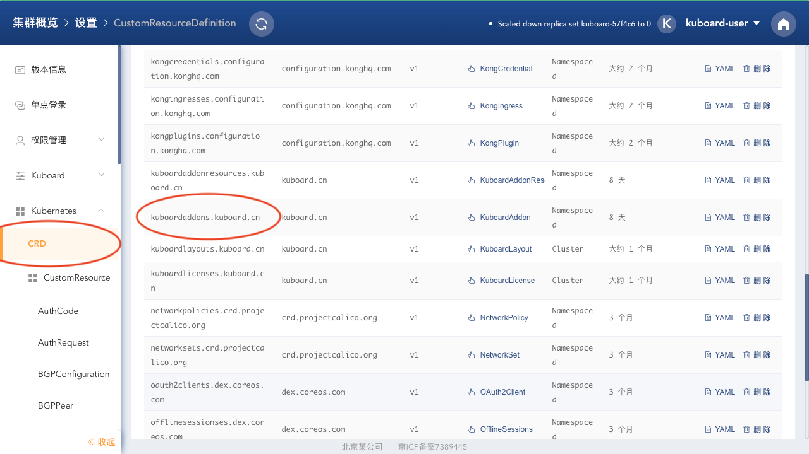
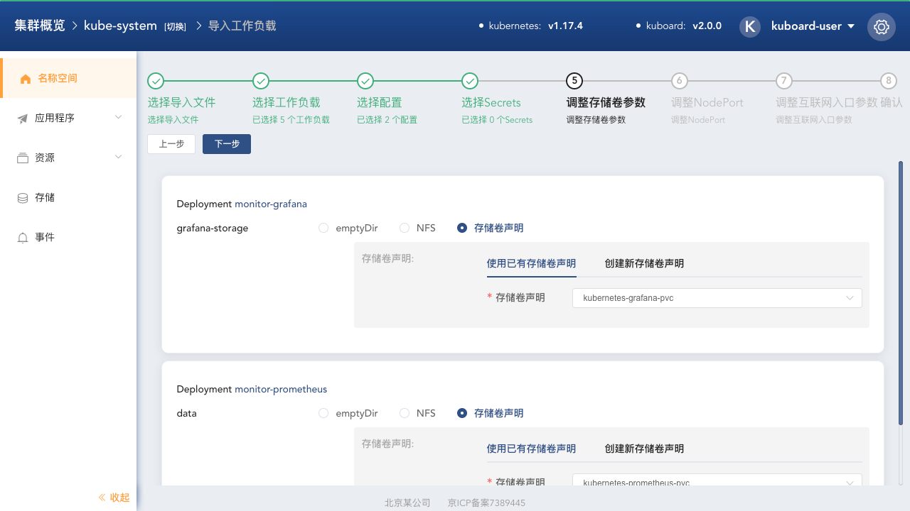

# 从 v2.0.0-beta.3.c 升级到 v2.0.0

v2.0.0 中，由于为了给套件增加授权相关的功能，对套件的 CRD 做了修改。如果您之前已经安装过 v2.0.0-beta.3.c 这个版本，请按如下步骤升级：

## 删除 CRD，并升级

* 以 **kuboard-user** 这个 ServiceAccount 登录 Kuboard；

  参考 [获取 **kuboard-user** 的登录 Token](/install/install-dashboard.html#获取token)。

* 点击 Kuboard 右上角的 **设置** 按钮，并在左侧菜单中导航到 **Kubernetes --> CRD** 子菜单，如下图所示：

  

* 删除上图中的 ***kuboardaddons.kuboard.cn*** 这个CRD；
* 在左侧菜单中导航到 **版本信息** 子菜单，并在 **版本信息** 子菜单中点击 **Upgrade** 按钮，升级到 v2.0.0 正式版。

## 重装套件，并使用之前的数据

请参考文档 [监控 example](/guide/example/monitor-v2.html)，重新完成套件的安装。

::: tip 重用原来的数据

在安装套件时，第 5 步，设置存储卷声明时，选择与上次安装监控套件时所使用的相同的存储卷声明，即可在监控套件中查看到之前的监控数据。

:::

