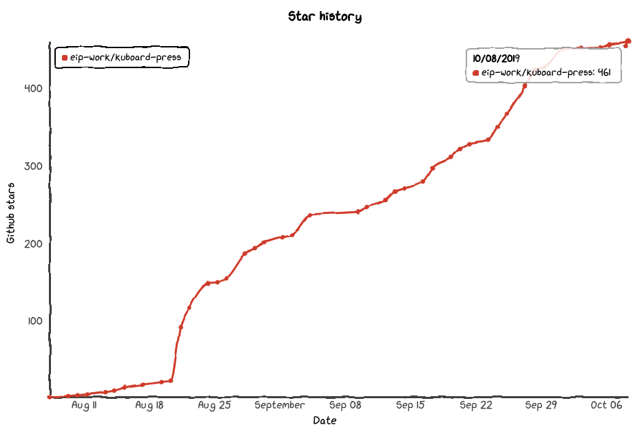

# Kuboard

<AdSenseTitle/>

## Kuboard 授权声明

* 许多网友在问，Kuboard收费么？
* 使用 Kuboard 是 免费 的，无论您是用于学习还是用于生产
* 将来会推出 Kuboard Plus，当前所有的功能，将来仍然免费。Kuboard Plus 侧重点：
  * 更完善的权限管理（当前只区分集群管理员权限和只读权限）
  * 审计日志

## Kuboard 采纳情况

<grid :rwd="{compact: 'stack'}">
  <grid-item size="2/3" :rwd="{tablet: '1/1', compact: '1/1'}" style="padding: 1rem 0 1rem 1rem;">
    <el-card style="height: 100%">
      
    </el-card>
  </grid-item>
  <grid-item size="1/3" :rwd="{tablet: '1/1', compact: '1/1'}" style="padding: 1rem 0 1rem 1rem;">
      <el-card style="height: 100%; color: #2c3e50; line-height: 1.7;">
        <li>Kuboard 诞生于大型微服务项目的落地实施，在其发布之前，就已经在许多个实际项目中经受住了考验</li>
        <li>Kuboard 一经发布，就获得了广泛的关注</li>
        <li>Kuboard 公开发布不到两个月时间，就已经获得了 461 Github Star（如图所示）</li>
        <li>Kuboard 社群中，已有许多的用户将 Kuboard 用于自己的生产环境</li>
      </el-card>
  </grid-item>
</grid>

## Kuboard 支持

<grid :rwd="{compact: 'stack'}">
  <grid-item size="1/3" :rwd="{tablet: '1/1', compact: '1/1'}" style="padding: 1rem 0 1rem 1rem;">
    <el-card style="height: 100%">
      <h3>QQ群（免费）</h3>
      

        <Qq/> 808894550
      

      

        
      

    </el-card>
  </grid-item>
  <grid-item size="2/3" :rwd="{tablet: '1/1', compact: '1/1'}" style="padding: 1rem 0 1rem 1rem;">
      <el-card style="height: 100%; color: #2c3e50; line-height: 1.7;">
        <h3>微信群</h3>
        

          

            扫第一个二维码完成打赏，扫第二个加微信进群聊（请发送打赏截图）
            

              </img>
              </img>
            

          

        

      </el-card>
  </grid-item>
</grid>

## Kuboard 商业支持

<grid :rwd="{compact: 'stack'}">
  <grid-item size="2/3" :rwd="{tablet: '1/1', compact: '1/1'}" style="padding: 1rem 0 1rem 1rem;">
    <el-card style="height: 100%; color: #2c3e50; line-height: 1.7;">
      <h3>服务范围</h3>
      <li>Kubernetes 企业培训</li>
      <li>DevOps 环境搭建及培训</li>
      <li>SpringCloud 微服务架构咨询</li>
      <li>Kubernetes 投产支持及问题解决</li>
      <li>Kuboard 定制化</li>
    </el-card>
  </grid-item>
  <grid-item size="1/3" :rwd="{tablet: '1/1', compact: '1/1'}" style="padding: 1rem 0 1rem 1rem;">
      <el-card style="height: 100%;">
        <h3>联系方式</h3>
        </img>
      </el-card>
  </grid-item>
</grid>

<!-- ### 微服务落地咨询

Kuboard 团队提供微服务实施落地的全过程咨询和实施，服务范围：

  

如有需要请加微信：

  </img>

 -->
