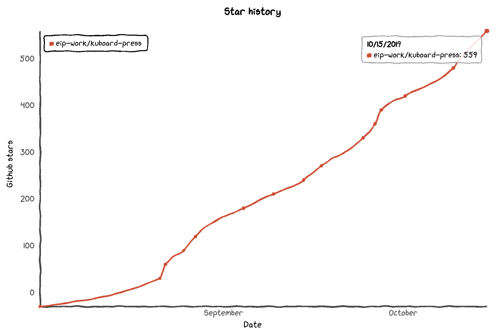

# Kuboard

<AdSenseTitle/>

## 授权声明

<grid :rwd="{compact: 'stack'}">
  <grid-item size="2/3" :rwd="{tablet: '1/1', compact: '1/1'}">

<b-card style="height: calc(100% - 1.5rem); color: #2c3e50; line-height: 1.7; margin-top: 1rem; border-color: #f2be45; background-color: rgba(242, 190, 69, 0.1)">

* 使用 Kuboard 是 免费 的，无论您是用于学习还是用于生产
* 将来会推出 Kuboard Plus，当前所有的功能，将来仍然免费。Kuboard Plus 侧重点：
  * 更完善的权限管理（当前只区分集群管理员权限和只读权限）
  * 审计日志
* 只要您在本文末尾的评论区留下公司名字，您就已经 **取得将 Kuboard 用于生产环境的授权** 

</b-card>

</grid-item>
  <grid-item size="1/3" :rwd="{tablet: '1/1', compact: '1/1'}">

<b-card style="height: calc(100% - 1.5rem); color: #2c3e50; line-height: 1.7; margin-top: 1rem">
  

    
  

</b-card>
  </grid-item>
</grid>

<!-- <KuboardLiscense></KuboardLiscense> -->

## Github趋势

<grid :rwd="{compact: 'stack'}">
  <grid-item size="2/3" :rwd="{tablet: '1/1', compact: '1/1'}">
    <b-card style="height: calc(100% - 2rem); margin-top: 1rem;">
      
    </b-card>
  </grid-item>
  <grid-item size="1/3" :rwd="{tablet: '1/1', compact: '1/1'}">
    <b-card style="height: calc(100% - 2rem); color: #2c3e50; line-height: 1.7; margin-top: 1rem;">
        <li>Kuboard 诞生于大型微服务项目的落地实施，在其发布之前，就已经在许多个实际项目中经受住了考验</li>
        <li>Kuboard 于2019年8月初公开发布，不到三个月时间就已经获得了 855 Github Star（如图所示），当前 <StarCount></StarCount></li>
        <li>Kuboard 社群中，已有许多的用户将 Kuboard 用于自己的生产环境</li>
      </b-card>
  </grid-item>
</grid>

## 商业支持

<grid :rwd="{compact: 'stack'}">
  <grid-item size="2/3" :rwd="{tablet: '1/1', compact: '1/1'}">
    <b-card style="height: 100%; color: #2c3e50; line-height: 1.7; margin-top: 1rem;">
      <h3>服务范围</h3>
      <li>Kubernetes 企业培训</li>
      <li>DevOps 环境搭建及培训</li>
      <li>SpringCloud 微服务架构咨询</li>
      <li>Kubernetes 投产支持及问题解决</li>
      <li>Kuboard 定制化</li>
    </b-card>
  </grid-item>
  <grid-item size="1/3" :rwd="{tablet: '1/1', compact: '1/1'}">
      <b-card style="height: 100%; margin-top: 1rem;">
        <h3>联系方式</h3>
        </img>
      </b-card>
  </grid-item>
</grid>

## 已采纳用户

只要您在此处留下公司名字，您就已经 **取得将 Kuboard 用于生产环境的授权** 

<!-- ### 微服务落地咨询

Kuboard 团队提供微服务实施落地的全过程咨询和实施，服务范围：

  

如有需要请加微信：

  </img>

 -->
