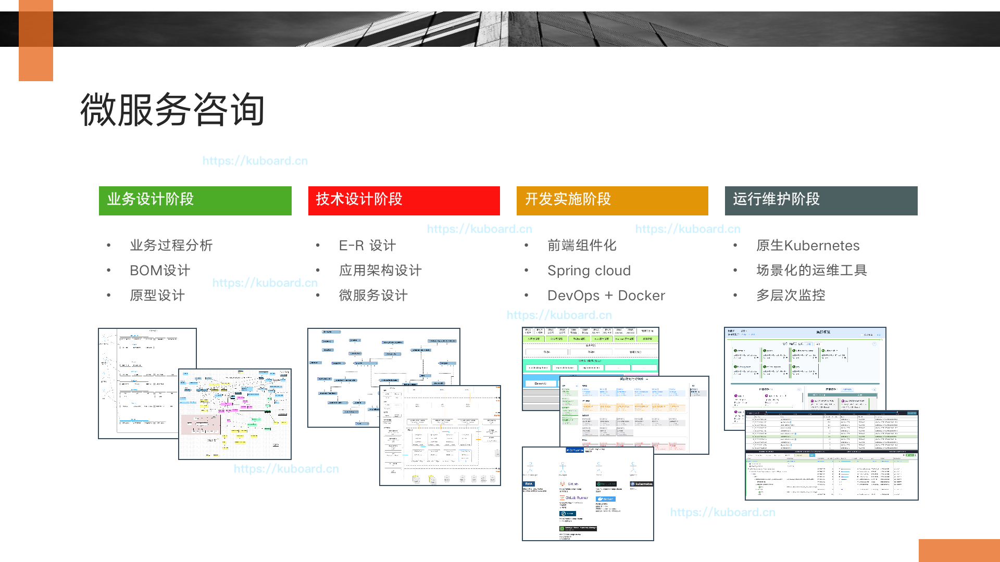

# Kuboard

<AdSenseTitle/>

## 授权声明

<grid :rwd="{compact: 'stack'}">
  <grid-item size="2/3" :rwd="{tablet: '1/1', compact: '1/1'}">

<b-card style="height: calc(100% - 1.5rem); color: #2c3e50; line-height: 1.7; margin-top: 1rem; border-color: #f2be45; background-color: rgba(242, 190, 69, 0.1)">

* 使用 Kuboard 是 免费 的，无论您是用于学习还是用于生产
* 只要您在本文末尾的评论区留下公司名字，您就已经 **取得将 Kuboard 用于生产环境的授权** 

</b-card>

</grid-item>
  <grid-item size="1/3" :rwd="{tablet: '1/1', compact: '1/1'}">

<b-card style="height: calc(100% - 1.5rem); color: #2c3e50; line-height: 1.7; margin-top: 1rem">
  

    
  

</b-card>
  </grid-item>
</grid>

<!-- <KuboardLiscense></KuboardLiscense> -->

## Github Star

<grid :rwd="{compact: 'stack'}">
<grid-item size="2/3" :rwd="{tablet: '1/1', compact: '1/1'}">
<b-card style="height: calc(100% - 2rem); margin-top: 1rem;">
  
      
<!--  -->

</b-card>
</grid-item>
  <grid-item size="1/3" :rwd="{tablet: '1/1', compact: '1/1'}">
    <b-card style="height: calc(100% - 2rem); color: #2c3e50; line-height: 1.7; margin-top: 1rem;">
        <li>
          Kuboard 于2019年8月初公开发布，当前：
          <li style="margin-left: 40px;">
            <StarCount></StarCount>
          </li>
          <li style="margin-left: 40px;">
            <StarCountDockerPulls></StarCountDockerPulls>
          </li>
        </li>
        <li>参考 kuboard.cn，通常一个月时间可以从 Kubernetes 入门到投产</li>
      </b-card>
  </grid-item>
</grid>

## 已采纳用户

只要您在此处留下公司名字，您就已经 **取得将 Kuboard 用于生产环境的授权** 

> 如果列表不能显示，请直接到这个链接留言 [Kuboard 授权列表](https://github.com/eip-work/kuboard-press/issues/71)

<!-- ### 微服务落地咨询

Kuboard 团队提供微服务实施落地的全过程咨询和实施，服务范围：

  

如有需要请加微信：

  </img>

 -->
