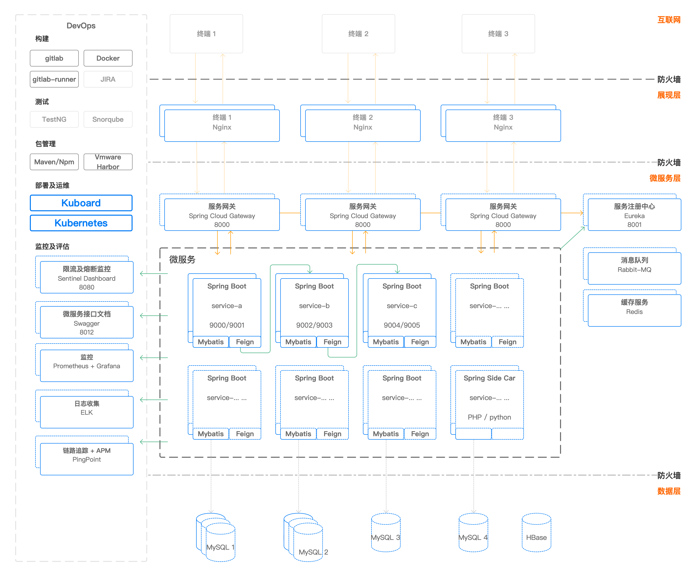
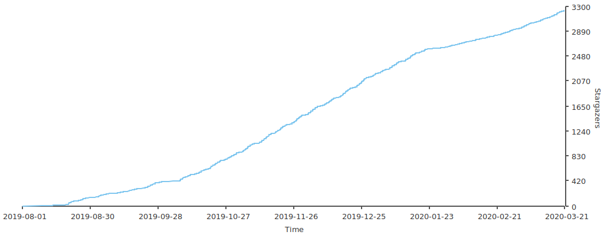

# Kuboard

<AdSenseTitle/>

## 产品定位

利用云原生技术，助力企业获得：

* 更快速的上市时间

  减少部署生产可用的 Kubernetes 集群所需的人力成本，快速满足您的应用程序开发需求；

* 更灵活的部署选项

  支持本地部署和云部署；

* 更坚实的企业级支持
  
  快速的问题响应支持，减少问题发生后对长期运营可能造成的潜在影响；

## 产品功能

* CI/CD

  支持 CI/CD 与 Kuberentes 的集成，实现应用的自动化部署和发布；实现开发团队与运维团队的高效衔接；

* 原生 Kubernetes 管理

  支持多种形式部署的 Kubernetes 集群：

  * 私有化部署；
  * 云端部署等；

* 多团队管理

  完善的权限控制管理，可基于企业的本地用户目录（例如 LDAP、GitLab CE/EE OAuth、GitHub CE/EE OAuth、KeyCloak等）实现单点登录。允许多个团队共享同一个 Kubernetes 集群，并拥有各自的名称空间；

* 微服务容器编排

  * 实现微服务应用的一键导出以及一键导入，可以轻松便捷地完成应用程序在新环境下的部署；
  * 基于 Kubernetes提供的原生功能，实现微服务容器编排的图形化操作、图形化展示，极大的降低 Kubernetes 的使用和管理门槛；
  * 提供按需调度、故障自动恢复的能力；
  * 通过日志跟踪、Web命令行终端、Kuboard Proxy 等多种手段，在容器化的环境下便捷地诊断和调试应用程序；
  * 支持 Spring Cloud、Dubbo 等主流微服务架构；

* 多层级监控

  开箱即用的多层级监控：

  * 资源层监控
  * 容器层监控
  * 中间件层监控
  * Java 虚拟机层监控、APM 监控
  * 链路层监控

* 聚合日志

  私有化部署的日志聚合工具：

  * 将 Kubernetes 集群中的容器日志聚合存储，并且可以根据用户 ID、交易 ID 查询到该用户/交易在所有微服务上的调用情况（日志）

## 产品架构图

下图示意了基于 Kuboard 的微服务架构及 DevOps 系统。

## 社区

Kuboard 在社区获得了广泛的欢迎，并在半年内获得 3200+ GitHub Star。已有近百家企业使用基于 Kubernetes +  Kuboard 的解决方案在 Kubernetes 上落地微服务架构。

