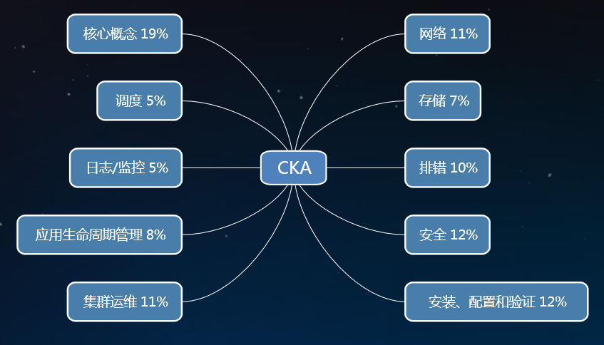

# CKA考试备战--每日一题

<AdSenseTitle/>

> CKA 考试每日一题系列，全部内容由 [我的小碗汤](https://mp.weixin.qq.com/s/5tYgb_eSzHz_TMsi0U32gw) 创作，本站仅做转载

这两年 Kubernetes 已经成为容器编排的事实标准，预计未来两年内将全面普及，现在企业招这块人才需求也越来越大，工资也是很高的，未来这块的发展空间也很大。

最近正准备备考CKA，CKA是什么？有些人可能还不知道，这里简单普及一下：

CKA 证书是云原生计算基金会 CNCF 组织的，考察的是你是否具备足够管理 Kubernetes 集群的必备知识。考试形式是上机直接在集群上操作，限时 3 小时，非常考验个人知识的扎实程度和 Kubernetes 实践经验。考上 75 分，你就能拿到证书。考试期间只可查阅K8S官方手册。证书有效期两年，考试费用300美元（国外考试费用就是贵），一年内可有一次免费补考的机会。

CKA证书的含金量如何？考不考这个证完全取决于个人，因为持证并不等于上岗，尤其是上心仪公司的岗。考证可以帮你获得初级职位，但高级职位需要个人经验的大量积累。而站在面试官的角度看，有这个证至少可以为你搏一个面试机会，尤其是应届生和有转岗想法的程序员。这些人可能缺乏足够经验，但 CKA 证很能体现个人技术水平，行业认可程度也很高。

**考纲如下：**

  

可访问 [https://github.com/cncf/curriculum](https://github.com/cncf/curriculum) 关注最新的考纲变化！

------

[CKA每日一题 - Day 1](./daily/001.html)

[CKA每日一题 - Day 2](./daily/002.html)

[CKA每日一题 - Day 3](./daily/003.html)

[CKA每日一题 - Day 4](./daily/004.html)

[CKA每日一题 - Day 5](./daily/005.html)

[CKA每日一题 - Day 6](./daily/006.html)

[CKA每日一题 - Day 7](./daily/007.html)

[CKA每日一题 - Day 8](./daily/008.html)

[CKA每日一题 - Day 9](./daily/009.html)

[CKA每日一题 - Day 10](./daily/010.html)

[CKA每日一题 - Day 11](./daily/011.html)

[CKA每日一题 - Day 12](./daily/012.html)

<JoinCKACommunity/>
