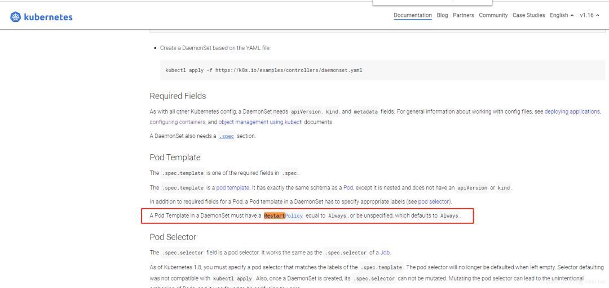
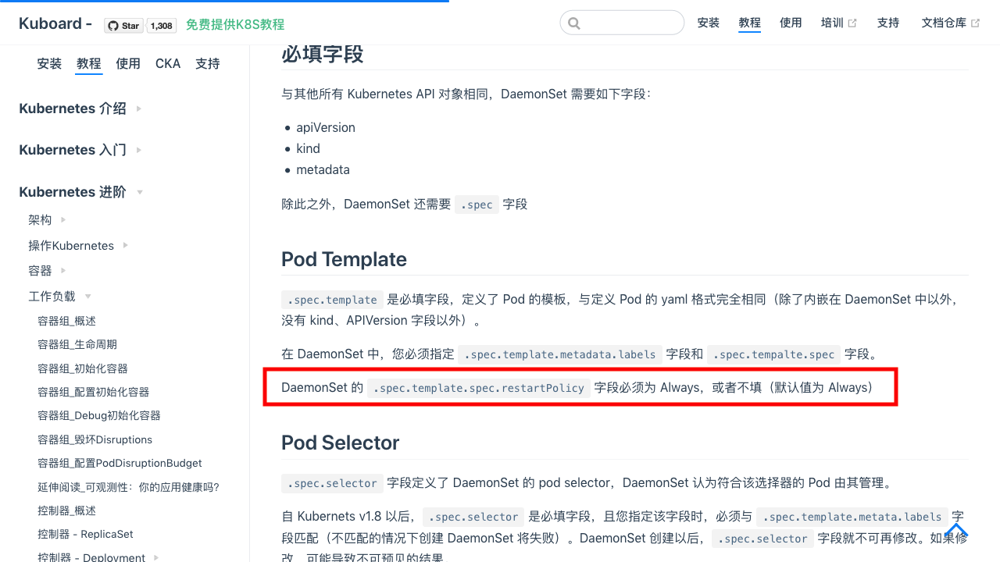

# CKA每日一题 --- Day 1

<AdSenseTitle/>

**今日考题**

以下 Daemonset yaml 中，哪些是正确的？（多选）

A. 

  ``` yaml
  apiVersion: apps/v1
  kind: DaemonSet
  metadata:
    name: fluentd-elasticsearch
    namespace: default
    labels: k8s-app: fluentd-logging 
  spec:
    selector:
      matchLabels:
        name: fluentd-elasticsearch
    template:
      metadata:
        labels:
          name: fluentd-elasticsearch
      spec:
        containers:
        - name: fluentd-elasticsearch
          image: gcr.io/fluentd-elasticsearch/fluentd:v2.5.1
          restartPolicy: Never
  ```


B. 

  ``` yaml
  apiVersion: apps/v1
  kind: DaemonSet
  metadata:
    name: fluentd-elasticsearch
    namespace: default
    labels:
      k8s-app: fluentd-logging
  spec:
    selector:
      matchLabels:
        name: fluentd-elasticsearch
    template:
      metadata: 
        labels: name: fluentd-elasticsearch
      spec: 
        containers: 
        - name: fluentd-elasticsearch 
          image: gcr.io/fluentd-elasticsearch/fluentd:v2.5.1 
          restartPolicy: Onfailure
  ```


C. 

  ``` yaml
  apiVersion: apps/v1 
  kind: DaemonSet 
  metadata: 
    name: fluentd-elasticsearch 
    namespace: default 
    labels: 
      k8s-app: fluentd-logging 
  spec: 
    selector: 
      matchLabels: 
    name: fluentd-elasticsearch 
    template: 
      metadata: 
        labels: name: fluentd-elasticsearch 
      spec: 
        containers: 
        - name: fluentd-elasticsearch 
          image: gcr.io/fluentd-elasticsearch/fluentd:v2.5.1 
          restartPolicy: Always
  ```


D. 
  ``` yaml
  apiVersion: apps/v1 
  kind: DaemonSet 
  metadata: 
    name: fluentd-elasticsearch 
    namespace: default 
    labels: 
      k8s-app: fluentd-logging 
  spec: 
    selector: 
      matchLabels: 
        name: fluentd-elasticsearch 
    template: 
      metadata: 
        labels: 
          name: fluentd-elasticsearch 
      spec: 
        containers: 
        - name: fluentd-elasticsearch 
          image: gcr.io/fluentd-elasticsearch/fluentd:v2.5.1
  ```


<b-button v-b-toggle.collapse-join-error variant="danger" size="sm" style="margin-top: 1rem;" v-on:click="$sendGaEvent('cka-daily', 'cka-daily', 'CKA每日一题001')">答案及解析</b-button>
<b-collapse id="collapse-join-error" class="mt-2">
<b-card style="background-color: rgb(254, 240, 240); border: solid 1px #F56C6C;">

**答案： C、D**


在考试时，只允许有考试网站和k8s两个标签页。所以平常学习时，尽可能去找文档去学习，才是最权威的。熟悉 [https://kubernetes.io/concepts/](https://kubernetes.io/concepts/) 目录下的内容对考试通过非常有帮助。

[https://kuboard.cn/learning/](https://kuboard.cn/learning/) 目录下提供了 [https://kubernetes.io/concepts/](https://kubernetes.io/concepts/) 目录下的中文翻译，可以对照着学习。

以这个问题为例，直接打开daemonset的说明文档，见以下链接：

[https://kubernetes.io/docs/concepts/workloads/controllers/daemonset/](https://kubernetes.io/docs/concepts/workloads/controllers/daemonset/)



> A Pod Template in a DaemonSet must have a RestartPolicy equal to Always, or be unspecified, which defaults to Always. Daemonset里的pod Template下必须有RestartPolicy，如果没指定，会默认为Always

在 [https://kuboard.cn](https://kuboard.cn) 上也可以找到对应的中文内容：

[https://kuboard.cn/learning/k8s-intermediate/workload/wl-daemonset/create.html](https://kuboard.cn/learning/k8s-intermediate/workload/wl-daemonset/create.html)




restartPolicy 字段，可选值为 Always、OnFailure 和 Never。默认为 Always。一个Pod中可以有多个容器，restartPolicy适用于Pod 中的所有容器。restartPolicy作用是，让kubelet重启失败的容器。

另外Deployment、Statefulset的restartPolicy也必须为Always，保证pod异常退出，或者健康检查 livenessProbe失败后由kubelet重启容器。[https://kubernetes.io/zh/docs/concepts/workloads/controllers/deployment](https://kubernetes.io/zh/docs/concepts/workloads/controllers/deployment) 或者 [https://kuboard.cn/learning/k8s-intermediate/workload/wl-deployment](https://kuboard.cn/learning/k8s-intermediate/workload/wl-deployment)

Job和CronJob是运行一次的pod，restartPolicy只能为OnFailure或Never，确保容器执行完成后不再重启。[https://kubernetes.io/docs/concepts/workloads/controllers/jobs-run-to-completion/](https://kubernetes.io/docs/concepts/workloads/controllers/jobs-run-to-completion/) 或者 [https://kuboard.cn/learning/k8s-intermediate/workload/wl-job/](https://kuboard.cn/learning/k8s-intermediate/workload/wl-job/)

> 实际考试以上机实操为主

</b-card>
</b-collapse>


> CKA 考试每日一题系列，全部内容由 [我的小碗汤](https://mp.weixin.qq.com/s/5tYgb_eSzHz_TMsi0U32gw) 创作，本站仅做转载


<JoinCKACommunity/>
