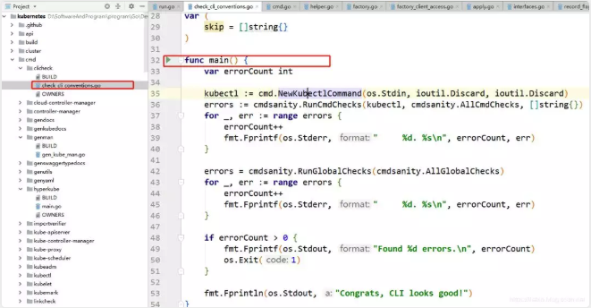
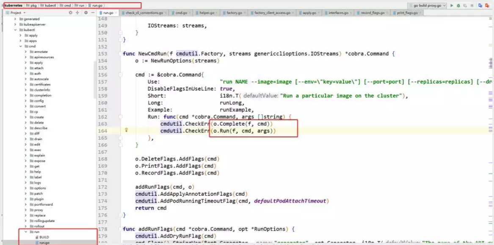
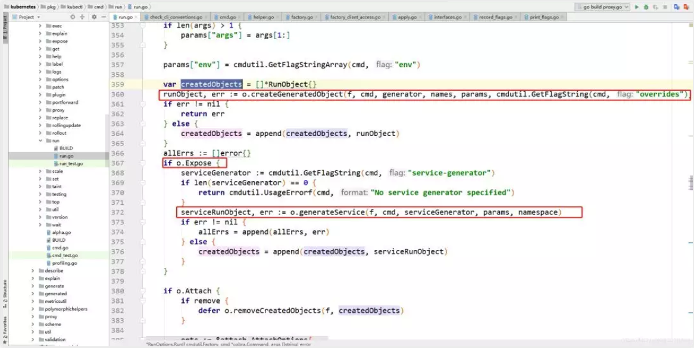
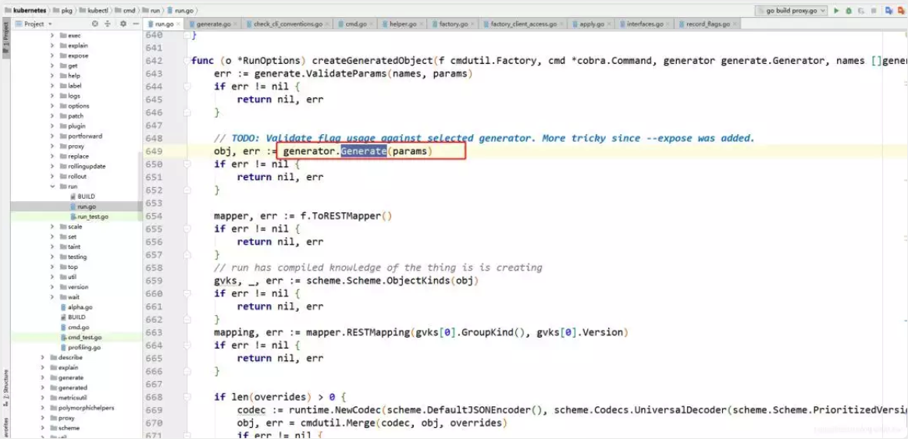

# CKA每日一题 --- Day 3

<AdSenseTitle/>


通过单个命令创建一个deployment并暴露Service。deployment和Service名称为cka-1120，使用nginx镜像， deployment拥有2个pod


<b-button v-b-toggle.collapse-join-error variant="danger" size="sm" style="margin-top: 1rem;" v-on:click="$sendGaEvent('cka-daily', 'cka-daily', 'CKA每日一题003')">答案及解析</b-button>
<b-collapse id="collapse-join-error" class="mt-2">
<b-card style="background-color: rgb(254, 240, 240); border: solid 1px #F56C6C;">

### 答案

``` sh
[root@liabio ~]# kubectl run  cka-1120 --replicas 2 --expose=true --port=80 --image=nginx

kubectl run --generator=deployment/apps.v1 is DEPRECATED and will be removed in a future version. Use kubectl run --generator=run-pod/v1 or kubectl create instead.
service/cka-1120 created
deployment.apps/cka-1120 created

[root@liabio ~]# kubectl get all | grep cka-1120
pod/cka-1120-554b9c4798-7jcrb   1/1 Running 0118m
pod/cka-1120-554b9c4798-fpjwj   1/1 Running 0118m
service/cka-1120  ClusterIP 10.108.140.25 <none> 80/TCP           118m
deployment.apps/cka-11202/222118m
```

### 解析


中提供了详细的kubectl使用方法，位于REFERENCE--kubectl CLI--kubectl Commands标签下。即：[https://kubernetes.io/docs/reference/generated/kubectl/kubectl-commands#run](https://mp.weixin.qq.com/s/V9Q7yewpE2Cm7jGiCmL1HA)

kubectl run会创建deployment或者job来管理Pod，命令语法如下：

``` sh
kubectl run NAME --image=image [--env="key=value"] [--port=port] [--replicas=replicas] [--dry-run=bool] [--overrides=inline-json] [--command] -- [COMMAND] [args...]
```

NAME指定deployment和service的名称；

--replicas缩写-r，指定实例数，默认为1；

--expose如果为true，会创建有ClusterIP的service，默认为false；

--port表示容器暴露的端口，如果expose为true，该端口也是service的端口；

--image指定容器用的镜像；

--dry-run为true时，只打印将要发送的对象，而不真正发送它，默认为false。

创建名为cka-1120-01，带环境变量的deployment

``` sh
kubectl run cka-1120-01 --image=nginx --env="DNS_DOMAIN=cluster.local" --env="POD_NAMESPACE=default"
```

创建名为cka-1120-02，带label的deployment

``` sh
kubectl run cka-1120-02 --image=nginx --labels="app=nginx,env=prod"
```

还有一个--restart参数，默认为Always，如果设置为OnFailure，则job会被创建；如果设置为Never，则普通Pod会被创建。

``` sh
[root@liabio ~]# kubectl run cka-1120-03 --image=nginx --restart=OnFailure
kubectl run --generator=job/v1 is DEPRECATED and will be removed in a future version. Use kubectl run --generator=run-pod/v1 or kubectl create instead.
job.batch/cka-1120-03 created
[root@liabio ~]#
[root@liabio ~]# kubectl run cka-1120-04 --image=nginx --restart=Never
pod/cka-1120-04 created
```

参数--schedule指定cronjob的定时规则，如果指定该参数，则会创建出cronjob

``` sh
[root@liabio ~]# kubectl run pi --schedule="0/5 * * * ?" --image=perl --restart=OnFailure -- perl -Mbignum=bpi -wle 'print bpi(2000)'
cronjob.batch/pi created
```

目前不支持直接创建Statefulset、Daemonset等资源对象。

**kubectl run执行后，到底发生了什么？**有必要看看kubectl源码，入口函数在$GOPATH\src\k8s.io\kubernetes\cmd\clicheck\checkcliconventions.go中



其中cmd.NewKubectlCommand为构建kubectl以及其子命令行参数。最终的执行业务逻辑的代码都在pkg\kubectl包下面。不同的子命令：apply、run、create入口对应的在pkg\kubectl\cmd下面：



最重要的o.Run(f, cmd, args)中会对kubectl run传入的参数进行一系列校验，填充默认值。

在360行调用o.createGeneratedObject根据不同的generator生成deployment、cronjob、job、pod等资源对象，并向apiserver发送创建请求。

如果设置了expose为true，在372行，同样的调用o.createGeneratedObject生成并创建service。



方法第649行，根据不同的generator实现生成不同的资源对象。



run命令对应的generator实现有以下几种，代码位于pkg\kubectl\generate\versioned\generator.go中的DefaultGenerators函数。

``` go
case"run":
  generator = map[string]generate.Generator{
    RunV1GeneratorName:                 BasicReplicationController{},
    RunPodV1GeneratorName:              BasicPod{},
    DeploymentV1Beta1GeneratorName:     DeploymentV1Beta1{},
    DeploymentAppsV1Beta1GeneratorName: DeploymentAppsV1Beta1{},
    DeploymentAppsV1GeneratorName:      DeploymentAppsV1{},
    JobV1GeneratorName:                 JobV1{},
    CronJobV2Alpha1GeneratorName:       CronJobV2Alpha1{},
    CronJobV1Beta1GeneratorName:        CronJobV1Beta1{},
  }
```

o.createGeneratedObject方法第689行对生成的资源对象向APIServer发送http创建请求。


具体的kubectl run命令的代码，感兴趣的同学可以进一步深挖，我也会在后续的源码分析系列文章中进行更详细的解析。


</b-card>
</b-collapse>

> CKA 考试每日一题系列，全部内容由 [我的小碗汤](https://mp.weixin.qq.com/s/5tYgb_eSzHz_TMsi0U32gw) 创作，本站仅做转载


<JoinCKACommunity/>
