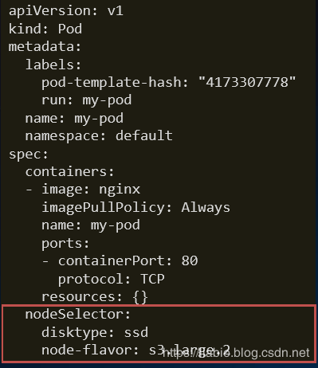
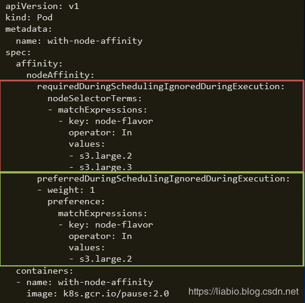
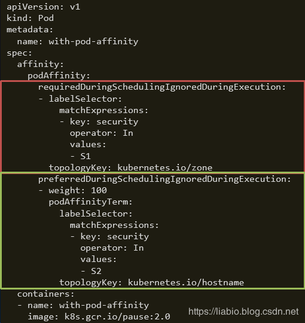

# CKA每日一题 --- Day 5

<AdSenseTitle/>

::: tip 考题


通过命令行，创建两个deployment。

- 需要集群中有2个节点 ；
- 第1个deployment名称为cka-1122-01，使用nginx镜像，有2个pod，并配置该deployment自身的pod之间在节点级别反亲和；
- 第2个deployment名称为cka-1122-02，使用nginx镜像，有2个pod，并配置该deployment的pod与第1个deployment的pod在节点级别亲和；

**最好提交最精简的deployment yaml，如果评论被限制，请提交反亲和性配置块yaml，也可多次评论提交**

:::

<b-button v-b-toggle.collapse-join-error variant="danger" size="sm" style="margin-top: 1rem;" v-on:click="$sendGaEvent('cka-daily', 'cka-daily', 'CKA每日一题005')">答案及解析</b-button>
<b-collapse id="collapse-join-error" class="mt-2">
<b-card style="background-color: rgb(254, 240, 240); border: solid 1px #F56C6C;">

### 答案

第一个deployment：cka-1122-01

```yaml
apiVersion: apps/v1
kind: Deployment
metadata:
  labels:
    app: cka-1122-01
  name: cka-1122-01
spec:
  replicas: 2
  selector:
    matchLabels:
      app: cka-1122-01
  template:
    metadata:
      labels:
        app: cka-1122-01
    spec:
      containers:
      - image: nginx
        name: cka-1122-01  
      affinity:
        podAntiAffinity:
          requiredDuringSchedulingIgnoredDuringExecution:
              labelSelector:
                matchExpressions:
                - key: app
                  operator: In
                  values:
                  - cka-1122-01
              topologyKey: "kubernetes.io/hostname"
```

## 第二个deployment：cka-1122-02

```yaml
apiVersion: apps/v1
kind: Deployment
metadata:
  labels:
    app: cka-1122-02
  name: cka-1122-02
spec:
  replicas: 2
  selector:
    matchLabels:
      app: cka-1122-02
  template:
    metadata:
      labels:
        app: cka-1122-02
    spec:
      containers:
      - image: nginx
        name: cka-1122-02
      affinity:
        podAffinity:
          requiredDuringSchedulingIgnoredDuringExecution:
          - labelSelector:
              matchExpressions:
              - key: app
                operator: In
                values:
                - cka-1122-01
            topologyKey: "kubernetes.io/hostname"
```

最终调度结果：

``` sh
NAME                           READY     STATUS    RESTARTS   AGE       IP           NODE
cka-1122-01-5df9bdf8c9-qwd2v    1/1      Running      0       8m     10.192.4.2     node-1
cka-1122-01-5df9bdf8c9-r4rhs    1/1      Running      0       8m     10.192.4.3     node-2  
cka-1122-02-749cd4b846-bjhzq    1/1      Running      0       10m    10.192.4.4     node-1
cka-1122-02-749cd4b846-rkgpo    1/1      Running      0       10m    10.192.4.5     node-2  
```


### 解析

**考点：k8s中的高级调度及用法。**

亲和性和反亲和性调度官方文档：

[https://kubernetes.io/docs/concepts/configuration/assign-pod-node/](https://kubernetes.io/docs/concepts/configuration/assign-pod-node/)

中文文档： [https://kuboard.cn/learning/k8s-intermediate/config/assign-pod-node.html](https://kuboard.cn/learning/k8s-intermediate/config/assign-pod-node.html)

#### 将 Pod 调度到特定的 Node 上：nodeSelector

nodeSelector是节点选择约束的最简单推荐形式。nodeSelector是PodSpec下的一个字段。它指定键值对的映射。为了使Pod可以在节点上运行，该节点必须具有每个指定的键值对作为label。



> 语法格式：map[string]string
>
> 作用：
> – 匹配node.labels
> – 排除不包含nodeSelector中指定label的所有node
> – 匹配机制 —— 完全匹配

#### nodeSelector 升级版：nodeAffinity

节点亲和性在概念上类似于nodeSelector，它可以根据节点上的标签来限制Pod可以被调度在哪些节点上。



**红色框为硬性过滤：**排除不具备指定label的node；在预选阶段起作用；

**绿色框为软性评分：**不具备指定label的node打低分， 降低node被选中的几率；在优选阶段起作用；

#### 与nodeSelector关键差异

> – 引入运算符：In，NotIn （labelselector语法） – 支持枚举label可能的取值，如 zone in [az1, az2, az3...] – 支持硬性过滤和软性评分 
>
> – 硬性过滤规则支持指定多条件之间的逻辑或运算 – 软性评分规则支持 设置条件权重值

#### 让某些 Pod 分布在同一组 Node 上：podAffinity

Pod亲和性和反亲和性可以基于已经在节点上运行的Pod上的标签而不是基于节点上的标签，来限制Pod调度的节点。

**规则的格式为：**

如果该X已经在运行一个或多个满足规则Y的Pod，则该Pod应该（或者在反亲和性的情况下不应该）在X中运行。

Y表示为LabelSelector。X是一个拓扑域，例如节点，机架，云提供者区域，云提供者区域等。



红框硬性过滤：排除不具备指定pod的node组；在预选阶段起作用；绿框软性评分：不具备指定pod的node组打低分， 降低该组node被选中的几率；在优选阶段起作用；

#### 与nodeAffinity的关键差异

> – 定义在PodSpec中，亲和与反亲和规则具有对称性 – labelSelector的匹配对象为Pod – 对node分组，依据label-key=topologyKey，每个labelvalue取值为一组 
>
> – 硬性过滤规则，条件间只有逻辑与运算

#### 避免某些 Pod 分布在同一组 Node 上：podAntiAffinity


#### 与podAffinity的差异

> – 匹配过程相同 
>
> – 最终处理调度结果时取反
> 即
> – podAffinity中可调度节点，在podAntiAffinity中为不可调度
> – podAffinity中高分节点，在podAntiAffinity中为低分


</b-card>
</b-collapse>

> CKA 考试每日一题系列，全部内容由 [我的小碗汤](https://mp.weixin.qq.com/s/5tYgb_eSzHz_TMsi0U32gw) 创作，本站仅做转载


<JoinCKACommunity/>
