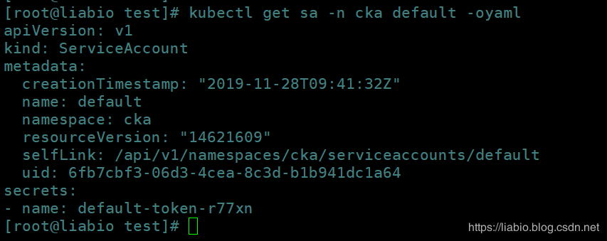
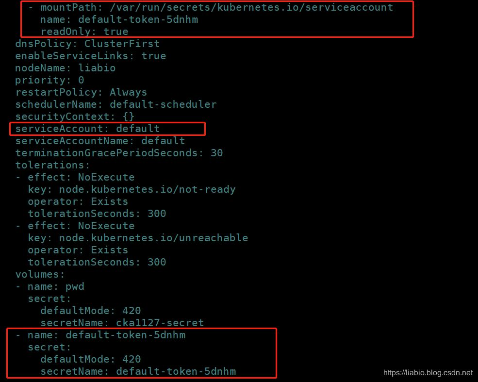
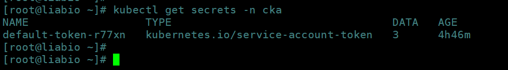
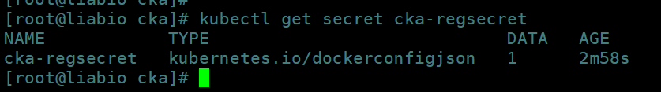

# CKA每日一题 --- Day 9

<AdSenseTitle/>

::: tip 考题

创建 Secret 名为 cka1127-secret，内含有 password 字段，值为 cka1127，然后在名为 cka1127-01 的 Pod1 里使用ENV进行调用，名为cka1127-02的 Pod2 里使用 Volume 挂载在 `/data` 下；

>  **注意：提交评论：包含命令和yaml，以及注意点。可分多次评论。**

:::

<b-button v-b-toggle.collapse-join-error variant="danger" size="sm" style="margin-top: 1rem;" v-on:click="$sendGaEvent('cka-daily', 'cka-daily', 'CKA每日一题009')">答案及解析</b-button>
<b-collapse id="collapse-join-error" class="mt-2">
<b-card style="background-color: rgb(254, 240, 240); border: solid 1px #F56C6C;">


## 答案

**创建secret方式一**
cka1127-secret.yaml可以是以下这样：

```yaml
apiVersion: v1
kind: Secret
metadata:
  name: cka1127-secret
type: Opaque
stringData:
  cka1127-password: cka1127
```

创建

```sh
[root@liabio test]# kubectl apply -f  cka-1127-secret.yaml 
secret/cka1127-secret created
```

**创建secret方式二**

```sh
kubectl create secret generic cka1127-secret --from-literal=password=cka1127
```

**名为cka1127-01的Pod yaml**

```yaml
apiVersion: v1
kind: Pod
metadata:
  name: cka1127-01
spec:
  containers:
  - name: nginx
    image: nginx
    volumeMounts:
    - name: pwd
      mountPath: /data/password
      readOnly: true
  volumes:
  - name: pwd
    secret:
      secretName: cka1127-secret
```

**名为cka1127-02的Pod yaml**

```yaml
apiVersion: v1
kind: Pod
metadata:
  name: cka1127-02
spec:
  containers:
  - image: nginx
    name: nginx
    env:
    - name: PASSWORD
      valueFrom:
        secretKeyRef:
          name: cka1127-secret
          key: password
```

volume形式验证，保证/data/password/下有password文件，文件内容为明文cka1127

```sh
[root@liabio ~]# kubectl exec -ti cka1127-01 sh
# 
# ls -l /data/password
total 0
lrwxrwxrwx 1 root root 15 Nov 28 00:40 password -> ..data/password
# cat /data/password/password
cka1127# 
# 
```

环境变量形式验证，保证env能查到name为PASSWORD的环境变量；

```sh
[root@liabio test]# kubectl exec -ti cka1127-02  bash
root@cka1127-02:/# 
root@cka1127-02:/# echo $PASSWORD
cka1127
root@cka1127-02:/#
```

## 解析

**secret官方文档：**
https://kubernetes.io/docs/concepts/configuration/secret/

中文文档：[https://kuboard.cn/learning/k8s-intermediate/config/secrets/](https://kuboard.cn/learning/k8s-intermediate/config/secrets/)

### secret简介

Kubernetes中的Secret资源可以用来存储密码、Token、秘钥等敏感数据， 将这些敏感信息保存在Secret中，相对于暴露到Pod、镜像中更加的安全和灵活。

你可能会觉得，secret一般不会用到，实际上在创建Pod时，Kubernetes会自动创建包含用于访问API的凭据的`secret`（由`kube-controller-manager`的`service account token controller`控制），并且它会自动修改Pod以使用这种类型的secret（这个由Admission Controller来控制）。

k8s每个namespace都会有一个Service Account，当我们创建namespace时，service account controller会监听namespace的创建，会在该namespace中创建一个名为default的Service Account，同时service account token controller会监听Service Account的创建，创建对应的secret，并将这个secret绑定到Service Account。

```
[root@liabio test]# kubectl create ns cka
namespace/cka created
[root@liabio test]# 
[root@liabio test]# kubectl get sa -n cka
NAME      SECRETS   AGE
default   1         11s
[root@liabio test]# kubectl get secrets -n cka
NAME                  TYPE                                  DATA   AGE
default-token-r77xn   kubernetes.io/service-account-token   3      18s
[root@liabio test]# 
```




当我们创建Pod时，如果未指定Service Account，则默认会在同一命令空间namespace中自动为其分配Service Account。则可以看到该spec.serviceAccountName字段已被自动设置。



您可以使用自动添加的Service Account凭据从Pod内部访问API，Service Account的API权限取决于所使用的授权插件和策略。

有关Service Account如何工作的更多信息，请参见文档：
https://kubernetes.io/docs/tasks/configure-pod-container/configure-service-account/

### Secret的类型

--type指定创建的秘密类型，Kubernetes内置了三种类型的Secret

##### kubernetes.io/service-account-token Secret

上面我们已经讲到，为了能从Pod内部访问Kubernetes API，Kubernetes提供了Service Account资源。Service Account会自动创建和挂载访问Kubernetes API的Secret，会挂载到Pod的 /var/run/secrets/kubernetes.io/serviceaccount目录中。namespace创建时自动创建的Service Account用到的Secret就是这种类型的。

在这里插入图片描述

##### Opaque Secret

Opaque类型的Secret是一个map结构(key-value)，其中vlaue要求以base64格式编码，以下示例中基本都为Opaque类型的Secret。

##### kubernetes.io/dockerconfigjson Secret

kubernetes.io/dockercfg类型的Secret用于存放私有Docker Registry的认证信息。当Kubernetes在创建Pod并且需要从私有Docker Registry pull镜像时，需要使用认证信息，就会用到kubernetes.io/dockercfg类型的Secret。

```sh
kubectl create secret docker-registry cka-regsecret \
--docker-server=coderaction \
--docker-username=admin \
--docker-password=123456 \
--docker-email=837448191@qq.com
```




在创建Pod时需要在Pod的spec中按如下形式使用：


```yaml
apiVersion: v1
kind: Pod
metadata:
  name: cka-private-reg
spec:
  containers:
    - name: cka-private-reg-container
      image: nginx
  imagePullSecrets:
    - name: cka-regsecret
```

**可以参考官方文档：**
https://kubernetes.io/docs/concepts/containers/images/#specifying-imagepullsecrets-on-a-pod

中文文档： [使用私有仓库中的镜像](https://kuboard.cn/learning/k8s-intermediate/private-registry.html)

**给分区默认的ServiceAccount添加imagePullSecrets，以至于创建的所有Pod可以自动添加spec.imagePullSecrets，详情参考官方文档：**
https://kubernetes.io/docs/tasks/configure-pod-container/configure-service-account/#add-imagepullsecrets-to-a-service-account

### secret创建

#### kubectl创建secret

**kubectl创建seccret官方文档：**
https://kubernetes.io/docs/reference/generated/kubectl/kubectl-commands#-em-secret-em-

**格式：**

```
kubectl create secret generic NAME [--type=string] [--from-file=[key=]source] [--from-literal=key1=value1] [--dry-run]
```

--from-literal：指定要插入的键和文字值（即mykey = somevalue），value为明文值，创建后会被base64编码；
--from-file：可以使用密钥文件的文件路径指定密钥文件，在这种情况下，将为它们指定默认名称；或者可以选择使用指定目录，这样将迭代该目录中的每个有效文件密钥。
--type：创建的秘密类型，上面已经介绍过三种类型；
--dry-run：如果为true，则仅打印将要向APIServer发送创建的对象，而不发送它。默认false；

#### 使用--from-file创建

```sh
[root@liabio cka]# echo -n 'admin' > ./username
[root@liabio cka]# echo -n 'test123' > ./password
[root@liabio cka]# echo -n 'shanghai' > ./city
[root@liabio cka]# ll
total 12
-rw-r--r-- 1 root root 9 Nov 28 20:44 city
-rw-r--r-- 1 root root 8 Nov 28 20:43 password
-rw-r--r-- 1 root root 6 Nov 28 20:43 username
[root@liabio cka]# kubectl create secret generic test-cka1127-01 --from-file=./username --from-file=./password
secret/test-cka1127-01 created
[root@liabio cka]# kubectl create secret generic test-cka1127-02 --from-file=./
secret/test-cka1127-02 created
[root@liabio cka]# 
```

以指定目录创建的secret，查看到目录下所有文件都被加到data下：

```yaml
kubectl get secrets test-cka1127-02 -oyaml
apiVersion: v1
data:
  city: c2hhbmdoYWkK
  password: dGVzdDEyMwo=
  username: YWRtaW4K
kind: Secret
metadata:
  creationTimestamp: "2019-11-28T12:44:57Z"
  name: test-cka1127-02
  namespace: default
  resourceVersion: "14636360"
  selfLink: /api/v1/namespaces/default/secrets/test-cka1127-02
  uid: 4a3a1a5d-09e6-4bf9-bbe3-3300db1ddf7a
type: Opaque
```

指定username和password创建的secret：

```yaml
kubectl get secrets test-cka1127-01 -oyaml
apiVersion: v1
data:
  password: dGVzdDEyMwo=
  username: YWRtaW4K
kind: Secret
metadata:
  creationTimestamp: "2019-11-28T12:44:47Z"
  name: test-cka1127-01
  namespace: default
  resourceVersion: "14636347"
  selfLink: /api/v1/namespaces/default/secrets/test-cka1127-01
  uid: 766516a2-34be-4a18-b4e2-83751a6cd2b7
type: Opaque
```

默认情况下，kubectl describe 命令能避免显示文件的内容。这可以防止将 secret 中的内容暴露给从终端日志记录中刻意寻找它们的人。

> 特殊字符，例如`不能识别此Latex公式: ，\，*，和!需要逃逸。在大多数常见的shell中，最简单的转义密码方法是用单引号（'）引起来。例如，如果您的实际密码是S!B*d`zDsb，则应以这种方式执行命令：
>
> kubectl create secret generic dev-db-secret
> --from-literal=username=devuser --from-literal=password='S!B*d$zDsb' 您无需从文件（--from-file）中转义密码中的特殊字符。

#### 手动创建Secret

还可以先在文件中以json或yaml格式创建一个Secret，然后创建该对象。该secret包含两种：`data`和是`stringData`是。data字段用于存储使用base64编码的任意数据。提供stringData字段是为了方便起见，它允许提供未编码的字符串。

例如，要使用data将两个字符串存储在Secret中，请按如下所示将它们转换为base64：

```sh
echo -n 'admin' | base64
YWRtaW4=
echo -n '1f2d1e2e67df' | base64
MWYyZDFlMmU2N2Rm
```

**注意：在转base64编码时，一定记得加-n参数，否则可能会遇到坑。**

然后创建以下yaml，最终`kubectl apply`

```yaml
apiVersion: v1
kind: Secret
metadata:
  name: mysecret
type: Opaque
data:
  username: YWRtaW4=
  password: MWYyZDFlMmU2N2Rm
```

如果用以下yaml创建，注意到用了stringData，user的值为coderaction明文。

```yaml
apiVersion: v1
kind: Secret
metadata:
  name: cka1127-secret-02
type: Opaque
stringData:
  user: coderaction
```

执行 `kubectl apply` 后查看：

```yaml
apiVersion: v1
data:
  user: Y29kZXJhY3Rpb24=
kind: Secret
metadata:
  name: cka1127-secret-02
type: Opaque
```

Y29kZXJhY3Rpb24=解码为coderaction

```sh
[root@liabio cka]# echo Y29kZXJhY3Rpb24= | base64 -d
coderaction
```

data和stringData的键必须由字母数字字符“-”，“ _”或“。”组成。

> 编码注意：secret数据的序列化JSON和YAML值被编码为base64字符串。换行符在这些字符串中无效，因此必须省略。base64在Darwin/macOS上使用该实用程序时，用户应避免使用该-b选项来分隔长行。相反，如果选项不可用，Linux用户应将选项添加-w 0到base64命令或管道中。base64 | tr -d '\n'-w

#### 从生成器创建Secret

从1.14开始，Kubectl支持使用Kustomize管理对象。使用此新功能，您还可以从生成器创建一个Secret，然后将其应用于在Apiserver上创建对象。

#### 使用Kuboard界面创建Secret

参考文档 [使用Kuboard界面创建Secret](/learning/k8s-intermediate/config/secrets/create-kuboard.html)

### 使用Secret

#### 将secret所有内容挂载为Pod里的文件

```yaml
apiVersion: v1
kind: Pod
metadata:
  name: mypod
spec:
  containers:
  - name: mypod
    image: redis
    volumeMounts:
    - name: foo
      mountPath: "/etc/foo"
      readOnly: true
  volumes:
  - name: foo
    secret:
      secretName: mysecret
```

这样Pod中的/etc/foo目录下会生成mysecret中的所有映射文件。

#### 将密钥投影到特定路径

我们还可以控制secret映射到卷中的路径。您可以使用.spec.volumes[].secret.items更改每个键的目标路径：

```yaml
apiVersion: v1
kind: Pod
metadata:
  name: mypod
spec:
  containers:
  - name: mypod
    image: redis
    volumeMounts:
    - name: foo
      mountPath: "/etc/foo"
      readOnly: true
  volumes:
  - name: foo
    secret:
      secretName: mysecret
      items:
      - key: username
        path: my-group/my-username
```

这样Pod中username存储在/etc/foo/my-group/my-username文件而非/etc/foo/username；而且没有password的映射文件。

#### secret文件权限

```yaml
apiVersion: v1
kind: Pod
metadata:
  name: mypod
spec:
  containers:
  - name: mypod
    image: nginx
    volumeMounts:
    - name: foo
      mountPath: "/etc/foo"
  volumes:
  - name: foo
    secret:
      secretName: cka1127-secret
      defaultMode: 256
```

然后，Secret将被挂载到/etc/foo并且由Secret卷挂载创建的所有文件权限为0400；

请注意，JSON规范不支持八进制表示法，因此对于0400权限，请使用值256。如果您使用yaml而不是json描述Pod，则可以使用八进制表示法以更自然的方式指定权限。

也可以像前面的示例一样使用映射，并为不同的文件指定不同的权限，如下所示：

```yaml
apiVersion: v1
kind: Pod
metadata:
  name: mypod-1
spec:
  containers:
  - name: mypod
    image: nginx
    volumeMounts:
    - name: foo
      mountPath: "/etc/foo"
  volumes:
  - name: foo
    secret:
      secretName: cka1127-secret-02
      items:
      - key: user
        path: my-group/my-username
        mode: 511
```

mode值511为十进制，在这种情况下，生成的文件的/etc/foo/my-group/my-username许可权值为八进制0777。由于JSON的限制，您必须以十进制表示法指定mode。

**请注意，如果稍后阅读此权限值，则可能会以十进制表示法显示。**

#### 环境变量

Pod中通过环境变量引用Secret和题目答案一样，不做累述；

> 以上事例来自于官方文档。方便大家学习。


</b-card>
</b-collapse>

> CKA 考试每日一题系列，全部内容由 [我的小碗汤](https://mp.weixin.qq.com/s/5tYgb_eSzHz_TMsi0U32gw) 创作，本站仅做转载


<JoinCKACommunity/>
