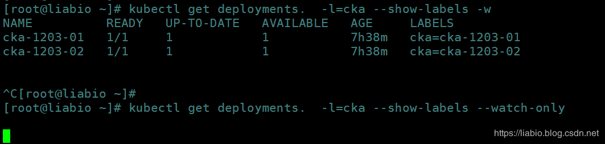

# CKA每日一题 --- Day 11

<AdSenseTitle/>

::: tip 考题

创建两个deployment名字分别为cka-1203-01、cka-1203-02；
  * cka-1203-01的Pod加label：cka：cka-1203-01；
  * cka-1203-02的Pod加label：cka：cka-1203-02；

请用利用kubectl命令label选择器查出这两个deployment，并按照创建时间排序。

例如：
```
NAME          READY   UP-TO-DATE   AVAILABLE   AGE
cka-1203-01   1/1     1            1           8m40s
cka-1203-02   1/1     1            1           8m38
```

:::

<b-button v-b-toggle.collapse-join-error variant="danger" size="sm" style="margin-top: 1rem;" v-on:click="$sendGaEvent('cka-daily', 'cka-daily', 'CKA每日一题011')">答案及解析</b-button>
<b-collapse id="collapse-join-error" class="mt-2">
<b-card style="background-color: rgb(254, 240, 240); border: solid 1px #F56C6C;">


## 答案

> 以下操作在k8s v1.15.2版本进行

创建加labels的deployment：

```sh
[root@liabio cka]#  kubectl run cka-1203-01   --image=nginx --labels="cka=cka-1203-01"
deployment.apps/cka-1203-01 created

[root@liabio cka]#  kubectl run cka-1203-02   --image=nginx --labels="cka=cka-1203-02"
deployment.apps/cka-1203-02 created
```

查询含有key为cka的labels的deploy，并按照时间排序。

```sh
[root@liabio cka]# kubectl get deploy --selector=cka --sort-by=.metadata.creationTimestamp
NAME          READY   UP-TO-DATE   AVAILABLE   AGE
cka-1203-01   1/1     1            1           4m24s
cka-1203-02   1/1     1            1           4m4s
```

## 解析

**kubectl get命令参考：**
https://kubernetes.io/docs/reference/generated/kubectl/kubectl-commands#get

```sh
 get [(-o|--output=)json|yaml|wide|custom-columns=...|custom-columns-file=...|go-template=...|go-template-file=...|jsonpath=...|jsonpath-file=...] (TYPE[.VERSION][.GROUP] [NAME | -l label] | TYPE[.VERSION][.GROUP]/NAME ...) [flags]
```

**--all-namespaces**：如果指定，将列出所有名称空间中的对象。即使同时指定--namespace和--all-namespaces，--namespace也会被忽略。默认为false，简写`-A`，如：`kubectl get pod -A`；

**--field-selector**：要过滤的选择器（字段查询），支持'='，'=='和'!='（例如--field-selector key1=value1,key2=value2）。该服务器仅支持每种类型有限数量的字段查询。

**--include-uninitialized**：如果为true，则kubectl命令适用于未初始化的对象。如果设置为false，则此标志会覆盖使kubectl命令应用于未初始化对象的其他标志，例如“ --all”。元数据的metadata.initializers为null被认定为已被初始化。默认为false

**--label-columns**：接受以逗号分隔的label列表，这些label将作为列显示。名称区分大小写。还可以使用多个标志选项，缩写`-L`，例如-L label1 -L label2 …

```sh
[root@liabio ~]# kubectl get deploy -L A=A -L b=b
NAME              READY   UP-TO-DATE   AVAILABLE   AGE     A=A   B=B
cka-1203-01       1/1     1            1           7h22m
```

**--no-headers**：使用默认或自定义列输出格式时，将不打印标题（默认打印标题）。默认false

```sh
[root@liabio ~]# kubectl get deployments. --no-headers 
cka-1203-01       1/1   1     1     7h23m
```

**--output**：简写`-o`，输出格式。下列之一：json | yaml | wide | name | custom-columns = … | custom-columns-file = … | go-template = … | go-template-file = … | jsonpath = … | jsonpath-file = …
参见自定义列
http://kubernetes.io/docs/user-guide/kubectl-overview/#custom-columns
golang模板：
http://golang.org/pkg/text/template/#pkg-overview
和jsonpath模板：
http://kubernetes.io/docs/user-guide/jsonpath

**--selector**：  简写为`-l` label选择器（标签查询）进行过滤，支持'=', '==', and '!='.例如：`-l key1=value1,key2=value2`，如果只写key将列出所有label中包含key的列表。如 `-l=cka将返回cka=cka-1203-01和cka=cka-1203-02`

**--show-kind**：如果存在，则列出所请求对象的资源类型，默认false；

```sh
[root@liabio ~]# kubectl get deployments. --show-kind
NAME                                    READY   UP-TO-DATE   AVAILABLE   AGE
deployment.extensions/cka-1203-01       1/1     1            1           7h30m
```

**--show-labels**：默认为false，打印时，将所有标签显示为最后一列（默认为隐藏标签列）

```sh
[root@liabio ~]# kubectl get deployments.  -l=cka --show-labels 
NAME          READY   UP-TO-DATE   AVAILABLE   AGE     LABELS
cka-1203-01   1/1     1            1           7h34m   cka=cka-1203-01
cka-1203-02   1/1     1            1           7h34m   cka=cka-1203-02
```

**--sort-by**：参数如果为非空，则使用此字段规范对列表进行排序。字段规范表示为JSONPath表达式（例如'{.metadata.name}'）。此JSONPath表达式指定的API资源中的字段必须为整数或字符串。

**--watch**：简写`-w`，默认为false，列出/获取请求的对象后，将监听变化时打印。如果未指定对象名称，则排除未初始化的对象。

**--watch-only**：默认false，监视对请求对象的更改，而无需开始时先list/get。

在这里插入图片描述

### 示例

1、查询含有lables为a=a和b=b的deploy：

```sh
[root@liabio cka]#  kubectl run cka-1203-03   --image=nginx --labels="a=a,b=b"
deployment.apps/cka-1203-03 created

[root@liabio cka]# kubectl get deploy --selector=a=a,b=b
NAME          READY   UP-TO-DATE   AVAILABLE   AGE
cka-1203-03   1/1     1            1           18s
```

2、列出环境内所有的pv并以name字段排序（使用kubectl自带排序功能），列出环境内所有的pv并以 capacity字段排序

```sh
kubectl get pv --sort-by=.metadata.name
kubectl get pv --sort-by=.spec.capacity.storage
```

3、列出不含某个标签的node的数量。`注意不要加title显示`

```sh
kubectl get nodes --selector=role!=staging --no-headers | wc -l 
```

4、列某个namepsace 下某个service所代表的所有pod的名字。

> 注意最终要的只是名字。
> 先kubectl get service看下label 是什么，再kubectl get pod -l 看下面名字，然后需要保留的是名字
> kubectl get pods "-o=custom-columns=NAME:.metadata.name"

```sh
# 获取label
kubectl get svc -o wide
[root@liabio ~]# kubectl get svc -o wide
NAME              TYPE        CLUSTER-IP       EXTERNAL-IP   PORT(S)           AGE     SELECTOR
solo              ClusterIP   10.99.151.11     <none>        8080/TCP          48d     name=solo
[root@liabio ~]# kubectl get pods -l name=solo -o name
pod/solo-57944994c5-zs5cw
```

5、请自定义列输出，只输出namespace和pod名称。

```sh
kubectl get pods  -o custom-columns=NAME:.metadata.name,NAMESPACE:.metadata.namespace
```

使用`custom-columns-file`

```sh
[root@liabio cka]# cat tmp.txt 
NAME          NAMESPACE
metadata.name metadata.namespace
[root@liabio cka]# kubectl get pods  -o custom-columns-file=tmp.txt
NAME                               NAMESPACE
cka-1203-01-849574cf7-b8dtc        default
cka-1203-02-77585c9945-vmb2h       default
cka-1203-03-587d78ccdb-l8n5x       default
```

**更多示例，请参考kubectl命令示例文档：**
https://kubernetes.io/docs/reference/kubectl/cheatsheet/

</b-card>
</b-collapse>

> CKA 考试每日一题系列，全部内容由 [我的小碗汤](https://mp.weixin.qq.com/s/5tYgb_eSzHz_TMsi0U32gw) 创作，本站仅做转载


<JoinCKACommunity/>
