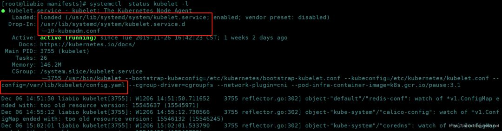
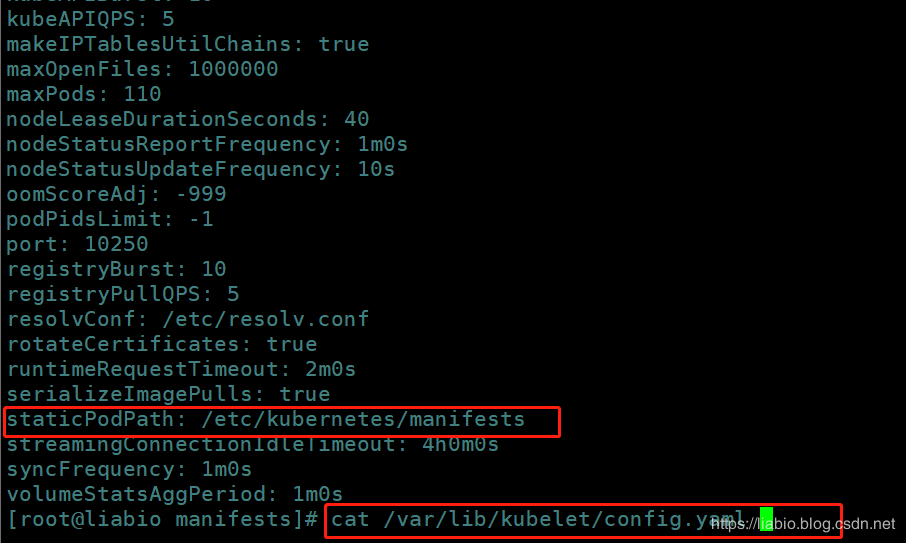
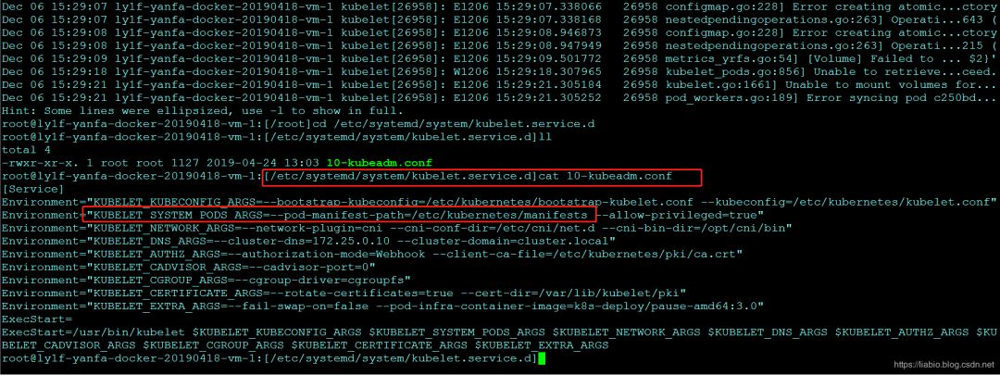

# CKA每日一题 --- Day 12

<AdSenseTitle/>

::: tip 考题

```sh
Set configuration context $ kubectl config use-context wk8s

configure the kubelet systemed managed service, on the node labelled with name=wk8s-node-1,to launch a pod containing a single container of image nginx named myservice automatically.

Any spec file requried should be placed in the /etc/kuberneteds/mainfests directory on the node

Hints:

You can ssh to the failed node using $ ssh wk8s-node-0

You can assume elevated privileges on the node with the following command $ sudo -i
```

> 请给出操作步骤。


:::

<b-button v-b-toggle.collapse-join-error variant="danger" size="sm" style="margin-top: 1rem;" v-on:click="$sendGaEvent('cka-daily', 'cka-daily', 'CKA每日一题011')">答案及解析</b-button>
<b-collapse id="collapse-join-error" class="mt-2">
<b-card style="background-color: rgb(254, 240, 240); border: solid 1px #F56C6C;">

## 答案

切换至wk8s上下文：

```sh
kubectl config use-context wk8s
```

查看有label`name=wk8s-node-1`的node的信息

```sh
kubectl get nodes -l name=wk8s-node-1 -o wide
```

登录指定的机器，并获得操作权限。

```sh
ssh wk8s-node-0
sudo -i
```

查看kubelet服务启动参数--config

```sh
systemctl status kubelet -l
```

在--config指定的文件中，找到staticPodPath文件目录

```sh
# cat /var/lib/kubelet/config.yaml|grep staticPodPath
staticPodPath: /etc/kubernetes/manifests
```

在静态pod目录下创建yaml，使用下面命令生成符合要求的myservice.yaml，等待kubelet自动拉起静态pod

```sh
kubectl run myservice --image=nginx --generator=run-pod/v1 --dry-run -o yaml > myservice.yaml
```


## 解析

**context相关操作官方命令指南：**
https://kubernetes.io/docs/reference/generated/kubectl/kubectl-commands#config

**Create static Pods说明：**
https://kubernetes.io/docs/tasks/configure-pod-container/static-pod/

本题主要考kubelet的配置，以及Static Pod的创建。

可以通过`systemctl status kubelet -l`查看kubelet进程的配置文件路径。




以及通过配置文件`config.yaml`找到`staticPodPath`。




有时候，情况可能会不一样，`systemctl status kubelet -l`查到的`10-kubeadm.conf`中没有`config.yaml`配置：




而是将其直接用`--pod-manifest-path`传入，所以这种情况就需要修改`10-kubeadm.conf`中的配置路径（如果路径不是期望路径）


``` sh
--pod-manifest-path=/etc/kubernetes/manifests
```

修改后需要重启kubelet：

``` sh
systemctl start kubelet
```

</b-card>
</b-collapse>

> CKA 考试每日一题系列，全部内容由 [我的小碗汤](https://mp.weixin.qq.com/s/5tYgb_eSzHz_TMsi0U32gw) 创作，本站仅做转载


<JoinCKACommunity/>
